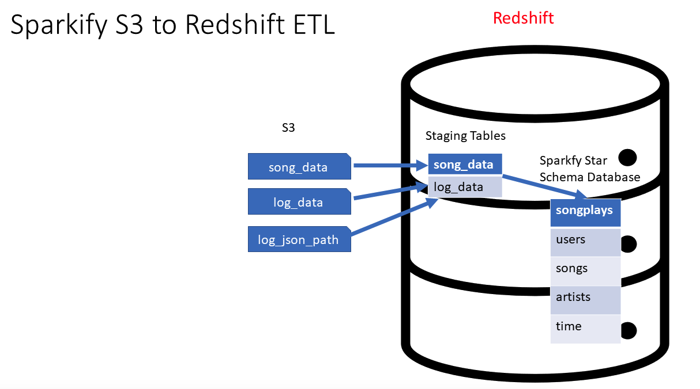

# Sparkify Analysis

## Overview

A music streaming startup, Sparkify, has grown their user base and song database and want to move their processes and data onto the cloud. Their data resides in S3, in a directory of JSON logs on user activity on the app, as well as a directory with JSON metadata on the songs in their app.

The project is to build an ETL pipeline that extracts their data from S3, stages them in Redshift, and transforms data into a set of dimensional tables for their analytics team to continue finding insights into what songs their users are listening to.

## System Architecture

## Business Requirements

- Analytics team wants to understand what songs their users are listening to by analyzing a set of dimensional tables.
- Analytics team wants a Data warehouse on the cloud with tables designed to optimize queries and gain insights on song plays.

## Engineering Tasks

- Create a Redshift cluster and IAM role to grant access to S3.
- Create a star schema and ETL pipeline to prepare the data for analytics team.
  - Explore & load raw data (JSON) in S3 to Redshift staging tables
  - Define fact & dimension tables for a star schema for this particular analytic purpose.
  - Write an ETL pipeline to load data from staging tables to analytics tables on Redshift.
- Connect to the Redshift cluster and run some test queries.
