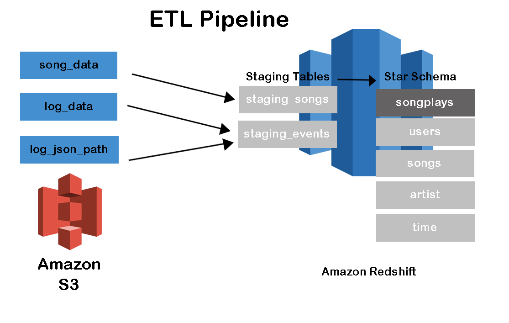
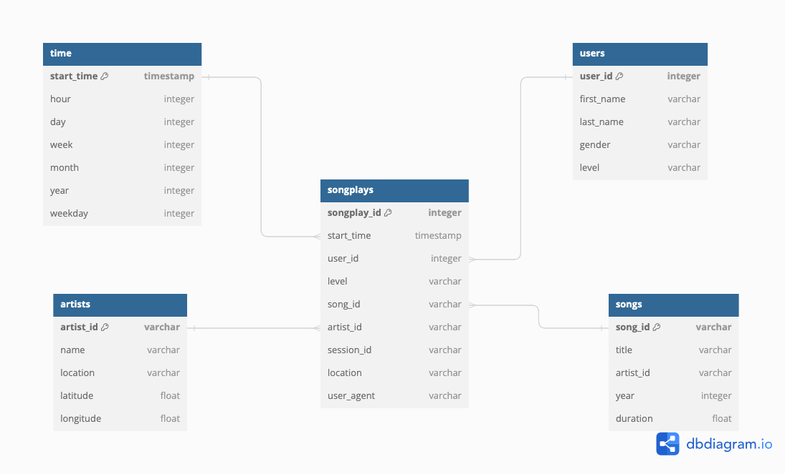
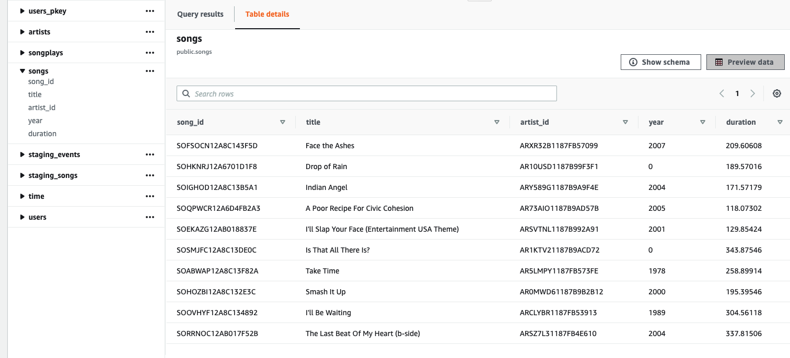

# Sparkify ETL Pipeline Analysis

## Overview

Sparkify, a music streaming startup, has expanded its user base and song database and now seeks to migrate its processes and data to the cloud. Their data is currently stored in S3, with JSON logs detailing user activity and JSON metadata about the songs in their app.

The goal of the project is to develop an ETL pipeline that extracts this data from S3, stages it in Redshift, and transforms it into a set of dimensional tables. This will enable their analytics team to gain insights into user listening habits.

## System Architecture



## Business Requirements

- Provide a cloud-based data warehouse with optimized table designs to enhance query performance and gain insights into song plays.
- Analyse data to identify trends in user listening habits and song popularity.

## Engineering Tasks

- Set up a Redshift cluster and configure an IAM role to allow S3 access.
- Develop a star schema and ETL pipeline to prepare the data for the analytics team.
  - Load raw JSON data from S3 into Redshift staging tables.
  - Define fact and dimension tables for a star schema tailored to this analytics purpose.
  - Implement an ETL pipeline to transfer data from staging tables to the analytics tables in Redshift.
- Connect to the Redshift cluster and execute some test queries.

## Dataset

- Song data: s3://udacity-dend/song_data

This dataset is a subset of the <a href="http://millionsongdataset.com/" target="_blank">Million Song Dataset</a>. Each file, in JSON format, contains metadata about a song and its artist. The files are partitioned by the first three letters of each song's track ID.

Here is the sample data

```bash
{"num_songs": 1, "artist_id": "ARJIE2Y1187B994AB7", "artist_latitude": null, "artist_longitude": null, "artist_location": "", "artist_name": "Line Renaud", "song_id": "SOUPIRU12A6D4FA1E1", "title": "Der Kleine Dompfaff", "duration": 152.92036, "year": 0}
```

- Log data: s3://udacity-dend/log_data

This dataset comprises log files in JSON format generated by an <a href="https://github.com/Interana/eventsim" target="_blank">event simulator</a>. These logs simulate app activity based on the songs from the aforementioned dataset, mimicking user interactions within a hypothetical music streaming app according to specified configuration settings.

Here is the sample data

```bash
{"artist":null,"auth":"Logged In","firstName":"Celeste","gender":"F","itemInSession":0,"lastName":"Williams","length":null,"level":"free","location":"Klamath Falls, OR","method":"GET","page":"Home","registration":1541078e+12,"sessionId":438,"song":null,"status":200,"ts":1541990217796,"userAgent":"\"Mozilla\/5.0 (Macintosh; Intel Mac OS X 10_9_4) AppleWebKit\/537.36 (KHTML, like Gecko) Chrome\/36.0.1985.143 Safari\/537.36\"","userId":"53"}
```

## Star Schema design



## Setup and configuration

1. Create virtual environment and activate it.

####

        python3.10 -m vevv .venv
        source .venv/bin/activate

2. Install dependencies

####

        pip install -r requirements.txt

3. Setup your IAM user on AWS, copy Access Key and Secret Key into `dwh.cfg`

```bash
[AWS]
KEY=
SECRET=
```

4. Create Redshift Cluster in `create_cluster.ipynb` and copy Redshift Endpoint and IAMRole into `dwh.cfg`

```bash
print("DWH_ENDPOINT :: ", DWH_ENDPOINT)
print("DWH_ROLE_ARN :: ", DWH_ROLE_ARN)
```

5. Create tables

```bash
% python src/create_tables.py
```

6. Create ETL pipeline

```bash
% python src/etl.py
```

## Testing

Select data from the songs table in AWS Redshift


